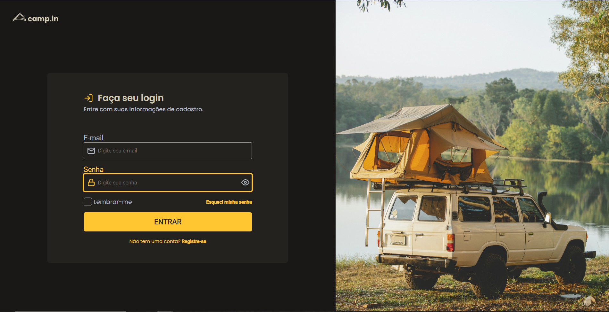
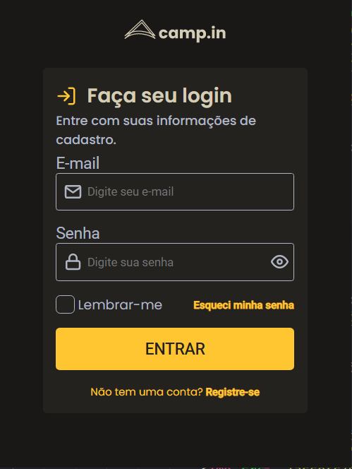

<h1 align="center">
 
    Login Form CSS
 
 
</h1>

##

    <a href="#-features">Features</a>&nbsp;&nbsp;&nbsp;|&nbsp;&nbsp;&nbsp;
    <a href="#-technologies">Technologies</a>&nbsp;&nbsp;&nbsp;|&nbsp;&nbsp;&nbsp;
    <a href="#-deploy">Deploy</a>&nbsp;&nbsp;&nbsp;|&nbsp;&nbsp;&nbsp;
    <a href="#-getting-started">Getting Started</a>&nbsp;&nbsp;&nbsp;|&nbsp;&nbsp;&nbsp;
    <a href="#-contributing">Contributing</a>&nbsp;&nbsp;&nbsp;|&nbsp;&nbsp;&nbsp;
    <a href="#memo-license">License</a>

 O layout foi construido a partir do figma disponibilizado no módulo discover e pode ser acessado <a href="https://www.figma.com/file/SX8XFyC5fAY09ai8Oykz0T/DD-%2F-Login-Form---CSS/duplicate">aqui</a>.   
 Neste desafio você vai construir uma página para a captação de leads ou newsletter. Utilizando HTML e CSS.

    

## 📈 Features
<!-- ❌✅ -->&nbsp;&nbsp;&nbsp;
1. ✅ Deve ser seguido o layout do Figma proposto.
2. ✅ Os inputs devem ter estilos diferentes dependendo do estado(normal ou em foco).
3. ✅ Deixar o layout responsivo como exemplo do Figma.
4. ❌ Adicionar funcionalidade de esconder ou não a senha(icone do olho).

## 🛠 Technologies

- *HTML;*
- *CSS;*

## 🚀 Deploy

- Veja o projeto sendo executado <a href="https://rafaeljurkfitz.github.io/login-form-css/">aqui</a>.

## 💻 Getting started

- Clone esse repositório apenas usando: `git clone https://github.com/rafaeljurkfitz/login-form-css.git`

## 🤝 Contributing

Contributions are what make the open source community such an amazing place to be learn, inspire, and create. Any contributions you make are **greatly appreciated**.

1. Fork the Project
2. Create your Feature Branch (`git checkout -b feature/AmazingFeature`)
3. Commit your Changes (`git commit -m 'Add some AmazingFeature'`)
4. Push to the Branch (`git push origin feature/AmazingFeature`)
5. Open a Pull Request

## :memo: License

This project is licensed under the MIT License - see the [LICENSE](https://opensource.org/licenses/MIT) page for details.
